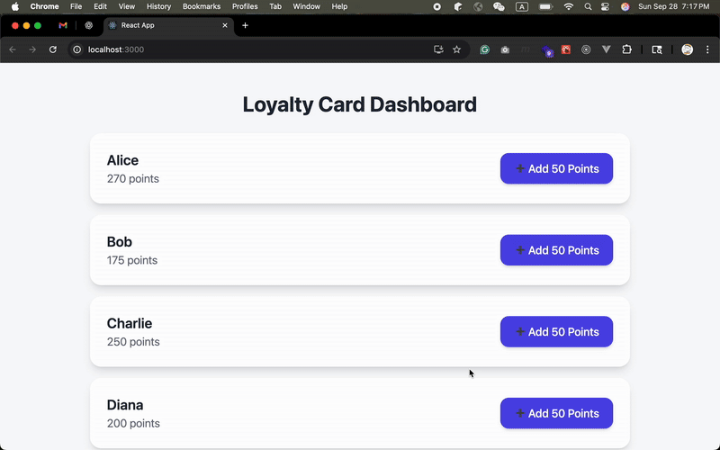

# loyalty-card-demo



- Frontend: React + Apollo Client (queries/mutations, live dashboard UI).

- Backend: Node.js + Express + Apollo Server, connected to MongoDB (remote cluster like Atlas).

- REST APIs: still exposed from backend alongside GraphQL.

- Use case: a “Live Loyalty Dashboard” (since you mentioned loyalty cards before, let’s stick with that—it’s simple but realistic).

🔹 Use Case: Live Loyalty Dashboard

A customer loyalty dashboard for store managers.

- They can see all customers and their points balance.

- They can add transactions (earn/spend points).

- They get real-time updates on balances (via GraphQL subscriptions).

- There’s also a REST API for legacy clients to fetch a single user’s balance.

## How to Run the Project

### 1. Configure Environment Variables

In the `server` folder, create a `.env.config` file with your MongoDB Atlas connection string:

```env
ATLAS_API=[your Atlas Mongoose connection URI]
```

### 2. Start the Backend (Server)

```bash
cd server
npm install
npm run start
```

### 3. Start the Frontend (Client)

```bash
cd app/client
npm install
npm run start
```

